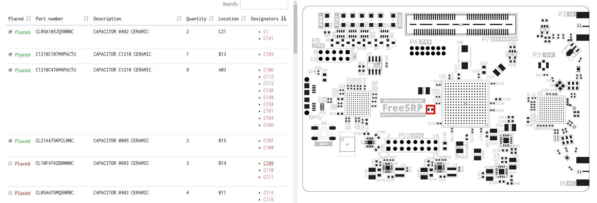

# AssemblyAssist

This was thrown together in one evening. Don't expect much. However, it *does* accomplish its simple goal: providing component placement information in a more user-friendly and effective way than printed out spreadsheets.

It needs 3 CSV files:

    * Your bill of materials, which maps your component designators to part numbers
    * The pick and place data, which maps the designators to a location on the circuit board
    * Your inventory, which maps part numbers in your bill of materials to some physical storage location

You should also give it pictures of your board's top and bottom layers.

Adjust settings in `settings.py`, run `python3 gen.py`, and open the HTML files generated in the output directory. Done.
